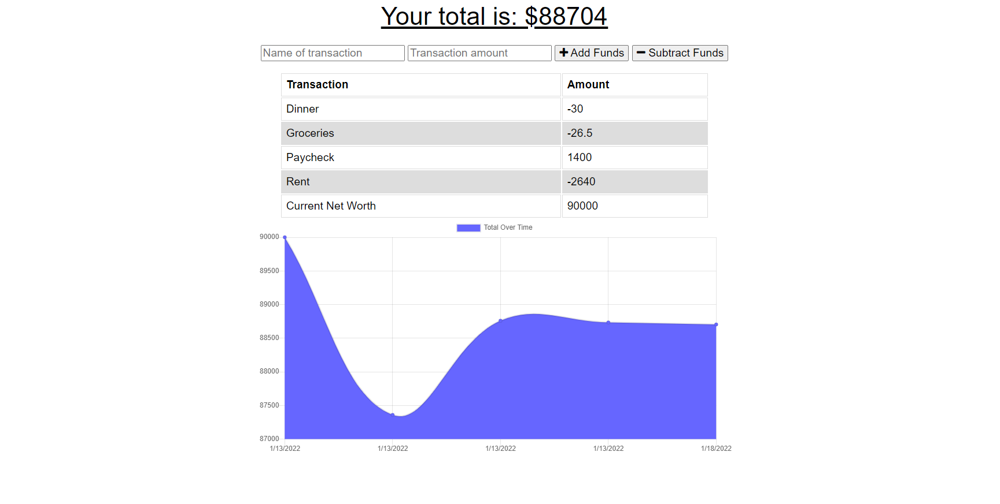

# Budget-Tracker-PWA

## Description
This budget tracker application leverages PWA to serve offline functionality and MongoDB to serve as a backend database.

## Table of Contents
  * [Installation](#installation)
  * [Usage](#usage)
  * [Questions](#questions)

## Installation
To install any dependencies run: npm install. 

## Usage
This application can be accessed via the following [Heroku app.](https://salty-waters-31131.herokuapp.com/) or run locally (see installation above for instructions).

Users can input any transactions and a short description and the application will complile all the transactions to return a graph of the user's transactions over time as well as the current total.

## Questions
For any questions, reach out to github.com/djamz919 via the following email address: djtm97@gmail.com.
